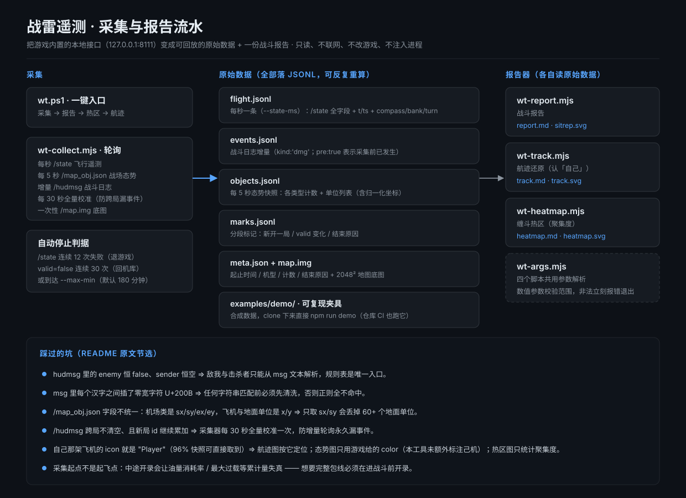
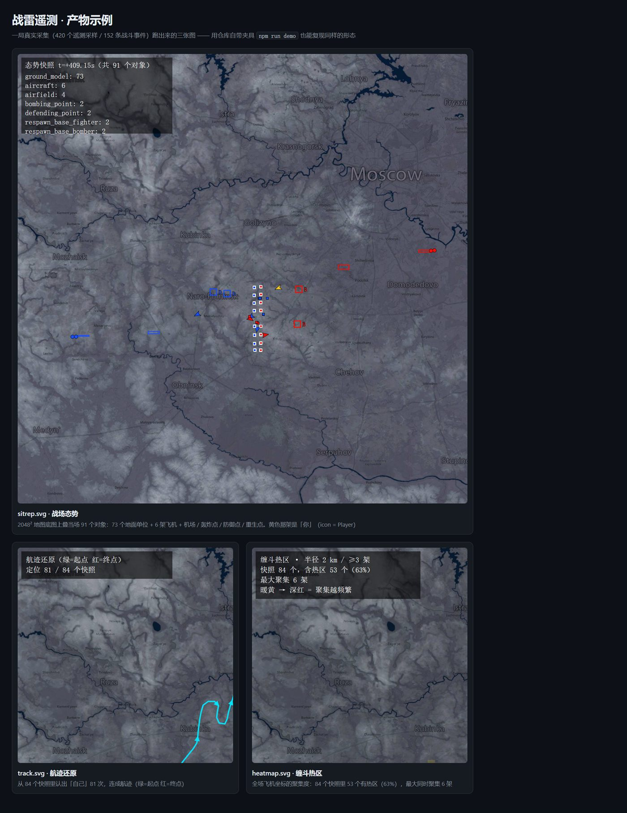

> **本工具由 DeepSeek（DSH agent）编写** · 仓库由 [CNyaotian](https://github.com/CNyaotian-Lunar) 维护与发布。
>
> **Written by DeepSeek (DSH agent)** · maintained and published by [CNyaotian](https://github.com/CNyaotian-Lunar).

# warthunder-telemetry · 战雷本地遥测采集与报告

**Local telemetry capture and reporting for War Thunder.**

把 War Thunder 内置的本地遥测接口（`http://127.0.0.1:8111/`）变成**可回放的原始数据 + 一份战斗报告**。

**English:** Turn War Thunder's built-in local telemetry endpoint (`http://127.0.0.1:8111/`) into **replayable raw data plus a combat report**.





> 上图为**产物示例**：用一次实测采集的数据渲染，仅示意图形样式，图中不含玩家昵称或对局 ID（地图地名来自游戏底图）。
>
> **English:** The image above is a **sample of the outputs**, rendered from one real capture session; it illustrates the visual style only. It contains no player nicknames and no match IDs (the place names come from the game's own map tile).

- `wt-collect.mjs` —— 采集器：每秒飞行遥测 + 战斗日志增量 + 每 5 秒战场态势，全部落 JSONL
  **English:** `wt-collect.mjs` — collector: flight telemetry once per second, incremental combat log, and battlefield situation every 5 seconds, all written to JSONL.
- `wt-report.mjs` —— 报告器：读采集目录，输出 `report.md` + `sitrep.svg`（底图叠单位）
  **English:** `wt-report.mjs` — reporter: reads a capture directory and writes `report.md` + `sitrep.svg` (units drawn over the map tile).
- `wt-heatmap.mjs` —— 缠斗热区：用全场飞机坐标算聚集度，输出 `heatmap.svg` + `heatmap.md`
  **English:** `wt-heatmap.mjs` — dogfight heatmap: computes clustering from every aircraft's coordinates and writes `heatmap.svg` + `heatmap.md`.
- `wt-track.mjs` —— 航迹还原：优先用 `icon: "Player"` 标记、兜底用 `compass` × 飞机 `dx/dy` 航向匹配认出"自己"，输出 `track.svg` + `track.md`
  **English:** `wt-track.mjs` — track reconstruction: prefers the `icon: "Player"` marker and falls back to matching `compass` against each aircraft's `dx/dy` heading to recognise "yourself"; writes `track.svg` + `track.md`.
- `wt.ps1` —— 一键：采集完自动出报告 + 热区图 + 航迹图；也可只出报告
  **English:** `wt.ps1` — one-shot: collects, then automatically produces the report + heatmap + track; it can also produce the report alone.

> 只读本地 HTTP 接口，不联网、不改游戏、不注入进程。
>
> **English:** It only reads a local HTTP endpoint — no network access, no game modification, no process injection.

## 前置 / Prerequisites

游戏正在运行，且**已经进入战斗**（在机库/菜单时接口可能没有有效数据）。
自检一行：

**English:** The game must be running and **already in a match** (while in the hangar or menus the endpoint may return no valid data). A one-line self-check:

```powershell
(Invoke-RestMethod http://127.0.0.1:8111/state).valid   # 期望 True
```

**English:** the expected value is `True`.

## 快速开始 / Quick Start

```powershell
cd <项目目录>

# 采一局（默认 180 分钟上限，回机库或退游戏自动停）
node .\wt-collect.mjs --me "你的游戏昵称"
node .\wt-report.mjs .\runs\run-20260921-141235 --me "你的游戏昵称"

# 或一键（采集完自动出报告）
.\wt.ps1 -Me "你的游戏昵称"
```

采集器结束时打印 `DONE <目录>`，把这个目录交给报告器即可。

**English:** When the collector finishes it prints `DONE <dir>`; hand that directory to the reporter. The commands above, in order: capture one match (default 180-minute cap; it stops by itself when you return to the hangar or quit the game), render a report for that captured directory, or run the one-shot `.\wt.ps1 -Me "<your nickname>"` which collects and reports in a single call.

### wt-collect.mjs 选项 / Options

| 选项 / Option | 默认 / Default | 说明 / Description |
|---|---|---|
| `--out DIR` | `runs/run-<时间戳>` | 输出目录 |
| `--base URL` | `http://127.0.0.1:8111` | 8111 基址 |
| `--me NAME` | 空 | 玩家昵称，写进 `meta.json` 供报告标注「你」 |
| `--state-ms N` | 1000 | 遥测采样间隔（毫秒） |
| `--obj-ms N` | 5000 | 战场态势采样间隔（毫秒） |
| `--max-min N` | 180 | 硬上限（分钟） |
| `--no-pre` | 关 | 启动时**不落盘**已有历史事件（跨局续打时用它，免得把上一局的日志算进来） |
| `--no-idle-stop` | 关 | 禁用「回机库自动停」 |

**English:**

| Option | Default | Description |
|---|---|---|
| `--out DIR` | `runs/run-<timestamp>` | output directory |
| `--base URL` | `http://127.0.0.1:8111` | base URL of the 8111 endpoint |
| `--me NAME` | empty | player nickname, written into `meta.json` so the report can label "you" |
| `--state-ms N` | 1000 | telemetry sampling interval (ms) |
| `--obj-ms N` | 5000 | battlefield situation sampling interval (ms) |
| `--max-min N` | 180 | hard cap (minutes) |
| `--no-pre` | off | **does not persist** pre-existing historical events at startup (use it when continuing across matches, so the previous match's log is not counted in) |
| `--no-idle-stop` | off | disables "stop automatically when back in the hangar" |

**自动停止条件**：`/state` 连续 12 次失败（退游戏/战斗结束）或 `valid=false` 连续 30 次（回机库）或到 `--max-min`。

**English:** Automatic stop conditions: 12 consecutive `/state` failures (game quit / match over), or `valid=false` 30 times in a row (back in the hangar), or reaching `--max-min`.

## 产出文件 / Output Files

| 文件 / File | 内容 / Contents |
|---|---|
| `meta.json` | 起止时间、机型、参数、采样/事件计数、结束原因 |
| `flight.jsonl` | 每秒一条（间隔由 `--state-ms` 决定），`/state` 全字段（`H, m` / `TAS, km/h` / `Ny` …），另加 `t`（相对秒）、`ts`（ISO），以及从 `/indicators` 取来的 `compass` / `bank` / `turn`（供航迹还原定位「自己」） |
| `events.jsonl` | 战斗日志增量（`/hudmsg`），`kind:'dmg'` 为战斗事件、`pre:true` 表示采集开始前已发生 |
| `objects.jsonl` | 每 5 秒战场态势快照（间隔由 `--obj-ms` 决定）：`counts` 各类型计数 + `objs` 单位列表（`type/color/icon/blink` + 坐标：机场类为归一化 `sx/sy/ex/ey`，飞机与地面单位是 `x/y` 并带航向向量 `dx/dy`） |
| `marks.jsonl` | 分段标记：新开一局（hudmsg id 回退 / 校准发现 id 重置）、`valid` 变化、机型变化、结束原因（启动失败另有 `fatal`） |
| `indicators.json` | `/indicators` 原始快照（含机型 `type` 字段），机型变化时会刷新 |
| `heartbeat.log` | 采集心跳日志（等价于采集过程的控制台输出，含机型、采样数、事件数、告警） |
| `map.img` | 地图底图 2048×2048 JPEG（报告画态势图用） |
| `report.md` / `sitrep.svg` | 报告器输出（另有 `track.md` / `track.svg`、`heatmap.md` / `heatmap.svg`） |

**English:**

| File | Contents |
|---|---|
| `meta.json` | start/end time, aircraft model, arguments, sample/event counts, stop reason |
| `flight.jsonl` | one line per second (interval set by `--state-ms`): all `/state` fields (`H, m` / `TAS, km/h` / `Ny` …) plus `t` (relative seconds), `ts` (ISO) and `compass` / `bank` / `turn` taken from `/indicators` (used by the track view to locate "yourself") |
| `events.jsonl` | incremental combat log (`/hudmsg`); `kind:'dmg'` marks combat events and `pre:true` means it happened before the capture started |
| `objects.jsonl` | battlefield situation snapshot every 5 seconds (interval set by `--obj-ms`): `counts` per type plus the `objs` unit list (`type/color/icon/blink` + coordinates — airfields use normalised `sx/sy/ex/ey`, aircraft and ground units use `x/y` with a heading vector `dx/dy`) |
| `marks.jsonl` | segment markers: new match (hudmsg id went backwards / calibration found the id reset), `valid` changes, aircraft-model changes, stop reason (a startup failure additionally emits `fatal`) |
| `indicators.json` | raw `/indicators` snapshot (including the `type` field), refreshed whenever the aircraft model changes |
| `heartbeat.log` | collector heartbeat log (equivalent to the collector's console output: aircraft model, sample count, event count, warnings) |
| `map.img` | map tile, 2048×2048 JPEG (used by the reporter to draw the situation view) |
| `report.md` / `sitrep.svg` | reporter output (plus `track.md` / `track.svg` and `heatmap.md` / `heatmap.svg`) |

## 8111 接口备忘（实测） / 8111 Endpoint Notes (as measured)

| 端点 / Endpoint | 内容 / Contents |
|---|---|
| `/state` | 飞行遥测：H / TAS / IAS / M / AoA / AoS / Ny / Vy / Mfuel / throttle / RPM / thrust / oil temp |
| `/indicators` | 仪表全量 + `type`（机型内部名，如 `fa_18c_late`） |
| `/map_obj.json` | 全部地图对象（`aircraft` / `ground_model` / `airfield` / `bombing_point` / `defending_point` / `respawn_base_*`），带 `color` + 归一化 `sx/sy/ex/ey` |
| `/map_info.json` | 归一化坐标 ↔ 世界坐标换算网格 |
| `/map.img` | 地图底图（2048×2048 JPEG） |
| `/hudmsg?lastEvt=&lastDmg=` | 战斗日志，**id 自增 ⇒ 可增量轮询** |
| `/mission.json` | 任务状态（`{"status":"running"}`） |
| `/` | 内置 telemap 网页（canvas 画的，页面上 "Please use a browser with canvas support" 只是占位文本） |

**English:**

| Endpoint | Contents |
|---|---|
| `/state` | flight telemetry: H / TAS / IAS / M / AoA / AoS / Ny / Vy / Mfuel / throttle / RPM / thrust / oil temp |
| `/indicators` | the full instrument set plus `type` (the game's internal aircraft-model name, e.g. `fa_18c_late`) |
| `/map_obj.json` | every map object (`aircraft` / `ground_model` / `airfield` / `bombing_point` / `defending_point` / `respawn_base_*`), with `color` + normalised `sx/sy/ex/ey` |
| `/map_info.json` | grid for converting between normalised and world coordinates |
| `/map.img` | map tile (2048×2048 JPEG) |
| `/hudmsg?lastEvt=&lastDmg=` | combat log; **ids increase monotonically ⇒ it can be polled incrementally** |
| `/mission.json` | mission status (`{"status":"running"}`) |
| `/` | the built-in telemap page (drawn with canvas; the "Please use a browser with canvas support" text on it is just placeholder copy) |

## 已知限制（踩过的坑） / Known Limitations (Pitfalls)

- 🩸 **hudmsg 里 `enemy` 恒 false、`sender` 恒空** —— 敌我/击杀者信息**只能从 `msg` 文本解析**，因此规则表（`wt-report.mjs` 的 `RULES`）是唯一解析入口，新版本文案变化要在这里补。
  **English:** In `hudmsg`, `enemy` is always false and `sender` is always empty — friend/foe and killer information **can only be parsed from the `msg` text**, so the rule table (`RULES` in `wt-report.mjs`) is the single parsing entry point, and any wording change in a new version has to be added there.
- 🩸 **`msg` 里每个汉字之间插了零宽字符（U+200B）** —— 任何字符串匹配前必须先清洗，否则正则全不命中。
  **English:** Every Chinese character in `msg` is separated by a zero-width character (U+200B) — any string matching must clean that first, otherwise no regex matches at all.
- ✅ **自己的坐标能拿到**：`/map_obj.json` 里自己那架飞机的 `icon` 字段就是 `"Player"`（实测 96% 快照可直接取到，历史数据也存了这个字段）。`wt-track.mjs` 首选按它定位，兜底才用 `compass` × 飞机 `dx/dy` 航向匹配 ⇒ 航迹图按它定位并连成航迹（`wt-track.mjs`）；态势图按游戏给的 `color` 上色，己机因此与其它飞机颜色不同（本工具未额外标注）；热区图只统计全场聚集度，不定位己机。
  **English:** Your own coordinates are available: in `/map_obj.json` your aircraft's `icon` field is exactly `"Player"` (measured: directly available in 96% of snapshots, and historical data stores this field too). `wt-track.mjs` prefers it for locating you and only falls back to matching `compass` against the aircraft's `dx/dy` heading ⇒ the track view locates you with it and joins the points into a track; the situation view colours you with the game-provided `color`, which makes your aircraft differ in colour from the others (this tool adds no extra marker of its own); the heatmap only measures whole-map clustering and does not locate your aircraft.
- ⚠️ **昵称要手传 `--me`**：接口不给玩家名，靠昵称子串在事件文本里匹配。昵称含战队标签（如 `[TAG]`）时传**不带标签的核心昵称**匹配率更高。
  **English:** The nickname must be passed manually via `--me`: the endpoint never exposes the player name, so the tool matches a nickname substring inside the event text. When the nickname carries a squadron tag (e.g. `[TAG]`), passing the **core nickname without the tag** gives a better match rate.
- ⚠️ **采集起点不是起飞点**：中途开始采集时，"油量消耗率 / 最大过载"等累计量会失真；想拿完整包线**必须在进入战斗前开录**。
  **English:** The capture start is not the takeoff point: if you start recording mid-match, cumulative values such as "fuel consumption rate / maximum G" are distorted; to get a complete envelope you **must start recording before entering the match**.
- ⚠️ 战斗加载瞬间 `/map_obj.json` 会返回**空数组**，采集器已跳过空快照。
  **English:** The moment a match loads, `/map_obj.json` returns an **empty array**; the collector already skips empty snapshots.
- 🩸 **`/map_obj.json` 字段不统一**：机场类是 `sx/sy/ex/ey`（矩形），**飞机与地面单位是 `x/y`**（另带 `dx/dy` 航向向量）。只取 `sx/sy` 会把 60+ 个地面单位全丢掉 —— 第一版就这么翻车的。
  **English:** `/map_obj.json` fields are not uniform: airfields use `sx/sy/ex/ey` (a rectangle) while **aircraft and ground units use `x/y`** (with an extra `dx/dy` heading vector). Reading only `sx/sy` drops all 60+ ground units — the first version crashed on exactly this.
- 🩸 **`/hudmsg` 跨局不清空**（换局后仍能拉到上一局的整份日志），且实测**新局 id 继续累加**（109 → 113）。⇒ 采集器每 30 秒做一次**全量校准**：发现 `maxId < lastId` 就判定 id 重置、写 `round_start` 并补拉，防止增量轮询永久漏事件。
  **English:** `/hudmsg` is not cleared between matches (after switching matches you can still pull the previous match's entire log), and measurement shows **the new match's ids keep increasing** (109 → 113). ⇒ Every 30 seconds the collector performs a **full calibration**: when it sees `maxId < lastId` it concludes the ids were reset, writes `round_start` and back-fills, which prevents incremental polling from permanently missing events.
- ⚠️ 多局连打：`marks.jsonl` 会记 `round_start`，但报告目前**按整段统计**（分局汇总还没做）。
  **English:** Playing several matches in a row: `marks.jsonl` records `round_start`, but the report currently **aggregates the whole session** (a per-match breakdown is not implemented yet).

## 待办 / TODO

- [ ] 分局统计（按 `marks.jsonl` 的 `round_start` 切段，每局单独出表）
  **English:** Per-match statistics (split by `round_start` in `marks.jsonl` and emit a separate table for each match).
- [ ] 态势动画（把 `objects.jsonl` 每个快照铺成 SVG 帧序列 / 或用 CDP 录成动图）
  **English:** Situation animation (lay every `objects.jsonl` snapshot out as an SVG frame sequence, or record an animated image via CDP).
- [x] 自己的位置：已用 `/map_obj.json` 里 `icon: "Player"` 的对象实现（见 `wt-track.mjs`），航迹图按它定位并连成航迹；热区图只统计全场聚集度，不定位己机；态势图按游戏给的 `color` 上色（本工具未额外标注己机）
  **English:** Own position: implemented via the object whose `icon` is `"Player"` in `/map_obj.json` (see `wt-track.mjs`); the track view locates you with it and joins the points into a track, the heatmap only measures whole-map clustering and does not locate your aircraft, and the situation view colours you with the game-provided `color` (the tool adds no extra own-aircraft marker).

## 目录速览 / Directory Overview

| 文件 / File | 作用 / Role |
|---|---|
| `wt-collect.mjs` | 采集（轮询 8111 → flight/events/objects/marks/map.img） |
| `wt-report.mjs` | 战斗报告（report.md + sitrep.svg）；`--units` 取 `metric` / `imperial` / `both`，默认 `both` |
| `wt-track.mjs` | 航迹还原（track.md + track.svg）；`--tol-deg`（默认 20）、`--max-step-km`（默认 4） |
| `wt-heatmap.mjs` | 缠斗热区（heatmap.md + heatmap.svg）；`--radius-km`（默认 5）、`--min-planes`（默认 3）、`--grid`（默认 64）、`--bin-sec`（默认 15） |
| `wt-args.mjs` | 四个脚本共用的参数解析（数值参数一律校验范围，非法即报错退出） |
| `wt.ps1` | Windows 一键（采集 + 报告 + 热区 + 航迹） |
| `examples/demo/` | **可复现的最小夹具**（合成数据，clone 下来直接 `npm run demo`） |
| `docs/` | 架构图 `architecture.svg` 与产物示例图 `samples.jpg` |
| `.github/workflows/ci.yml` | CI：语法检查 + 用夹具跑通三个脚本 |

**English:**

| File | Role |
|---|---|
| `wt-collect.mjs` | capture (polls 8111 → flight/events/objects/marks/map.img) |
| `wt-report.mjs` | combat report (report.md + sitrep.svg); `--units` takes `metric` / `imperial` / `both`, default `both` |
| `wt-track.mjs` | track reconstruction (track.md + track.svg); `--tol-deg` (default 20), `--max-step-km` (default 4) |
| `wt-heatmap.mjs` | dogfight heatmap (heatmap.md + heatmap.svg); `--radius-km` (default 5), `--min-planes` (default 3), `--grid` (default 64), `--bin-sec` (default 15) |
| `wt-args.mjs` | argument parsing shared by the four scripts (numeric arguments are always range-checked and exit with an error when invalid) |
| `wt.ps1` | one-shot Windows entry point (capture + report + heatmap + track) |
| `examples/demo/` | the **minimal reproducible fixture** (synthetic data; `npm run demo` right after cloning) |
| `docs/` | architecture diagram `architecture.svg` and sample-output image `samples.jpg` |
| `.github/workflows/ci.yml` | CI: syntax check + running the three scripts against the fixture |

## 快速验证 / Quick Verification

```bash
npm run check   # 五个脚本语法检查
npm run demo    # 用 examples/demo 夹具跑通报告/航迹/热区（仓库自带 CI 跑同一套夹具）
```

**English:** `npm run check` runs a syntax check on the five scripts; `npm run demo` exercises the report / track / heatmap scripts against the `examples/demo` fixture (the repo's own CI runs the same fixture).

参数写错会**立刻报错**而不是静默变成 NaN，例如：

**English:** A wrong argument **fails immediately** instead of silently turning into NaN, for example:

```
$ node wt-collect.mjs --state-ms abc
✗ --state-ms 需要一个数字（遥测采样间隔毫秒），收到："abc"
```

**English:** i.e. `--state-ms` needs a number (the telemetry sampling interval in milliseconds), but received `"abc"`.

## 运行环境 / Requirements

- **Node.js ≥ 18** —— `package.json` 的 `engines.node`；本机在 **Node 24** 上实测通过（`npm run check` 与 `npm run demo` 均 exit 0）。
- **运行依赖：无**（零第三方包；`wt.ps1` 是 Windows PowerShell 包装脚本，可选）。
- **数据来源**：本地 War Thunder 的 8111 端口 HTTP 接口（游戏内需开启本地 HTTP 服务）；本工具只读它，不注入、不修改游戏。
- **平台**：`wt-*.mjs` 跨平台；`wt.ps1` 仅 Windows。

**English:**
- **Node.js ≥ 18** — see `engines.node` in `package.json`; verified on **Node 24** here (`npm run check` and `npm run demo` both exit 0).
- **Runtime dependencies: none** (zero third-party packages; `wt.ps1` is an optional Windows PowerShell wrapper).
- **Data source**: the local War Thunder HTTP endpoint on port 8111 (enable the in-game local HTTP server). This tool only reads it — it does not inject into or modify the game.
- **Platform**: the `wt-*.mjs` scripts are cross-platform; `wt.ps1` is Windows-only.

## 权限与依赖 / Permissions & Dependencies

> 本节保守声明本工具对系统的接触面；除下列各项外，未发现其它访问行为。

### 文件 / Files

- **读取**：采集目录下的 `flight.jsonl` / `events.jsonl` / `objects.jsonl` / `marks.jsonl` / `meta.json` / `map.img`（报告器、航迹、热区三个脚本的输入）；`examples/demo/` 是仓库自带的合成夹具。
- **写入**：数据目录（默认 `<脚本目录>/runs/run-<时间戳>`，可用 `--out` 改）内的 `meta.json`、`flight.jsonl`、`events.jsonl`、`objects.jsonl`、`marks.jsonl`、`indicators.json`、`heartbeat.log`、`map.img`；以及在既有数据目录里**覆盖** `report.md` / `sitrep.svg` / `track.md` / `track.svg` / `heatmap.md` / `heatmap.svg`。
- 不读用户主目录、不读环境变量里的路径；除默认输出目录外，所有目录都由调用者显式给出。
- 磁盘占用随时长增长：`objects.jsonl` 在长局里可达数百 MB，请自行留出空间。

*Reads:* `flight.jsonl` / `events.jsonl` / `objects.jsonl` / `marks.jsonl` / `meta.json` / `map.img` inside the data directory (inputs of the report / track / heatmap scripts); `examples/demo/` is a synthetic fixture shipped with the repo.
*Writes:* `meta.json`, `flight.jsonl`, `events.jsonl`, `objects.jsonl`, `marks.jsonl`, `indicators.json`, `heartbeat.log`, `map.img` inside the data directory (default `<script dir>/runs/run-<timestamp>`, changeable with `--out`); and **overwrites** `report.md` / `sitrep.svg` / `track.md` / `track.svg` / `heatmap.md` / `heatmap.svg` in an existing data directory.
It does not read the user home directory or paths from environment variables; apart from the default output directory, every directory is given explicitly by the caller.
Disk usage grows with run length: `objects.jsonl` can reach hundreds of MB in long matches — leave enough free space.

### 网络 / Network

- **仅**访问 `--base` 指定的地址，默认 `http://127.0.0.1:8111`（游戏内置的本地遥测接口），请求路径为 `/state`、`/indicators`、`/map_obj.json`、`/map.img`、`/hudmsg`。
- 不访问任何外部域名、不上传数据；采集与报告全程可离线运行（`npm run demo` 只读仓库内的夹具）。
- 若用 `--base` 指向其它地址，网络行为即由该地址决定。

It contacts **only** the address given by `--base`, default `http://127.0.0.1:8111` (the game's built-in local telemetry endpoint), requesting `/state`, `/indicators`, `/map_obj.json`, `/map.img`, `/hudmsg`.
No external domains are contacted and no data is uploaded; collection and reporting work fully offline (`npm run demo` reads only the bundled fixture).
If `--base` points elsewhere, the network behaviour is determined by that address.

### 命令 / Commands

- 不调用任何外部命令（不 spawn 子进程、不调用 shell），除 Node 内置模块外**零依赖**。
- 不需要管理员 / root 权限；不安装服务、不写注册表、不改系统设置。
- `wt.ps1` 只要求 `node` 在 PATH 中，它仅以 `node <脚本> <参数>` 的形式调用本仓脚本，不做提权。

It calls no external commands (no subprocess spawn, no shell), and has **zero dependencies** beyond Node built-in modules.
It requires no administrator / root privileges; it installs no service, writes no registry key, changes no system setting.
`wt.ps1` only needs `node` on PATH; it invokes this repo's scripts as `node <script> <args>` and never elevates.

### 凭据 / Credentials

- 不读取、不存储任何凭据、令牌或密钥，也没有配置文件。
- 唯一可能带上身份的信息是 `--me` 传入的玩家昵称：它会被写进 `meta.json` 与报告正文（默认空；是否写入由调用者决定）。

It reads and stores no credentials, tokens or keys, and has no config file.
The only identity-bearing value is the player nickname passed via `--me`: it is written into `meta.json` and the report body (empty by default; the caller decides whether to pass it).

### 生命周期脚本 / Lifecycle scripts

- **无**。`package.json` 中只有 `collect` / `report` / `track` / `heatmap` / `demo` / `check` 六个显式命令，没有 `preinstall` / `postinstall` 之类的隐式钩子。

**None.** `package.json` only defines the explicit `collect` / `report` / `track` / `heatmap` / `demo` / `check` commands — no implicit `preinstall` / `postinstall` style hooks.

### 已知风险 / Known risks

- 采集内容来自游戏日志与遥测，战斗日志文本里可能包含**其它玩家的昵称**；公开分享 `runs/` 目录或 `report.md` 之前请自行确认内容。
- 报告写入的是**数据目录名**而非绝对路径，但仍建议对外只发布你确认过内容的产物。
- 本工具假定「游戏正在本机运行」，游戏版本更新可能改变字段与文案，导致事件识别率下降（未识别率超过 30% 时报告会显式告警）。

Collected content comes from game logs and telemetry, so combat-log text may contain **other players' nicknames**; review the contents before publicly sharing a `runs/` directory or a `report.md`.
The report writes the **data directory name** rather than an absolute path, but you should still only publish artifacts whose contents you have reviewed.
The tool assumes the game is running locally; game updates may change fields and message wording, lowering event-recognition rates (the report warns explicitly when the unmatched rate exceeds 30%).
